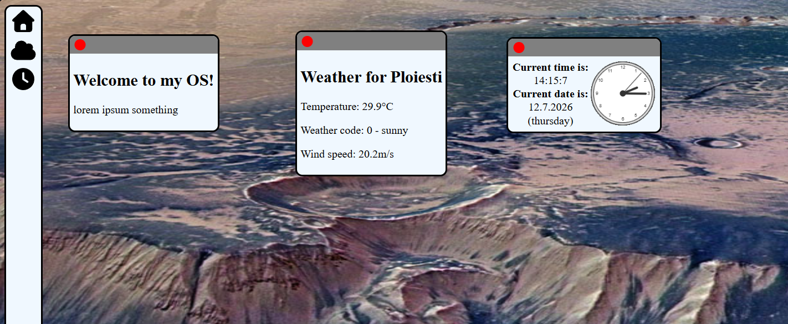
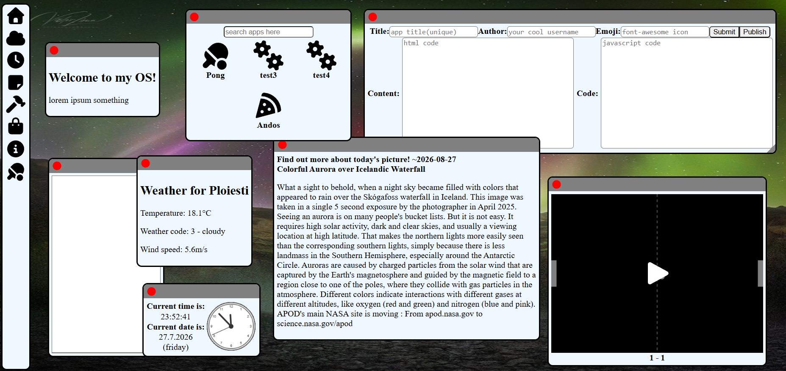

# andOS

A modular web operating system that runs entirely in your browser. Built with vanilla JavaScript, no backend, no frameworks.

---

old version (first ship)
---

new version (last ship)
---
> The current version is hosted right here:
> <https://clumsy261.github.io/andOS/>

---

## Features

| Feature | Description |
| ------- | ----------- |
| **Home greeting** | Welcome message shown on boot |
| **Weather service** | Local weather via your IP location |
| **Clock / calendar** | Analog clock + live date/time |
| **Notes app** | Quick notes with a resizable window |
| **Background app** | NASA APOD-backed info card that changes the desktop background daily |
| **bscode builder** | Interface to write custom apps, free of bugs (bug studio code get it?) |
| **Public app shop** | Browse and install community apps from a shared database |

---

## The App Shop

Write an app in **bscode**, publish it to the shared database, and anyone using andOS can find and install it from the **store**. Each app is a pair of:

- **Content** — the HTML that renders inside the window
- **Code** — the JavaScript that makes it live (optional)

---

## Notes for developers

The apps use a template, custom built to be imported into the main script.js later. For more details, check the custom.js from this repo, or just try doodling something in the bscode editor :D

Also, here are some useful predefined concepts:

| Name | Description |
| ------- | ----------- |
| card | actual window element, all of the app is contained within this |
| handle | simple string all app functions are based off (navbar id, closebutton id, etc.) |
| resizeElement(card) |  function applies small resize nudge on the corner of the window |

Any other functions can be implemented from scratch.

!! Disclaimer, the ping pong app was made with ai (mostly), but was thoroughly checked by me :) and has no bugs/ logic errors.

!! Disclaimer II, most of this project has been made much easier by ai. Personally I used an opencode cli on plan mode, just to understand what an eventlistener is and so further. The code is still handwritten by me, but most of the research was made with ai because stack overflow feels ancient.